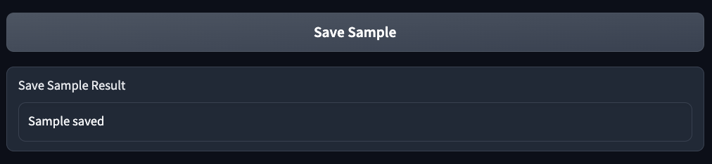

# Test Task Submission
## Luis Bandres
### August 18th, 2023
---

### Features:
   * **Language:** Python
   * **Framework:** LangChain + OpenAi
   * **Model:** gpt-3.5-turbo

This App contains 7 Steps required to complete the Test Task:

1. **Step 1: Load Data** - Users upload a template file and a new data file to the application.
2. **Step 2: Transformations using LLM** - The application processes the input data using token-efficient Sequential Chains in LangChain to map the input table to the template table.
3. **Step 3: Generate Python Code** - The application generates a Python script designed to transform the input table into the desired format, based on the results of Step 2.
4. **Step 4: Saving Training Data** - The application saves the current prompt used in Step 3 for creating the Python code and the generated script for potential future model training.
5. **Step 5: Download Python Code** - Users can download the generated Python code after confirming the results of Steps 2 and 3.
6. **Step 6: Advanced Options** - A chatbot, powered by OpenAI GPT-3.5, assists users in editing the code, with the table analysis and generated Python code pre-loaded into the assistant.
7. **Step 7: Additional Task. Use Fine-Tuned Model** - This step outlines a methodology for retraining a Davinci Model (GPT-3.5) or ADA model using OpenAI CLI, based on the training samples collected during Step 4.
   - **Step 7.1: Training Model** - Initiates the training of a custom fine-tuned model using the OpenAI CLI.
   - **Step 7.2: Loading Model** - Allows users to select and load a specific fine-tuned model.
   - **Step 7.3: Make Inferences (Completion Task)** - Uses the loaded fine-tuned model to generate additional Python script based on the current prompt produced in Step 3.

## Model Used:

### `gpt-3.5-turbo`


## Step 1: Load Data


### STEP 2: Transformations using LLM

This step does not require historical data for completion, making it token-efficient.

The process employs Sequential Chains for LangChain, enabling the parsing of multiple inputs and outputs, akin to Directed Acyclic Graphs (DAGs).

In these Sequential Chains, individual chains require only the outputs from previous chains. They do not necessitate observation of the previous prompts' history.

### 2.1 Prompt: Extraction of Metadata from Template

In this step, the system extracts metadata from the provided template. The result of this process is a JSON object.

```python
"""

You will be provided with a table in a markdown format as << INPUT >>.

If there is not a markdown table in the input return an empty JSON object. Otherwise, return a JSON object formatted to look like:

<< FORMATTING >>
{{{{
    "template_metadata": [
        {{{{
            "header": string, \ name of the column. If the input does not contain a header suggest a name for the column based on its data.
            "type": string, \ type of the data column of the markdown file in the input. 
            "sample": \ put a not null samble of the column. This sample should have the most common value which is not null.
            "categorical": bool \ check if the column is categorical (true) or not categorical (false).
            "categories_list": [] \ list of the unique values if the column is categorical.
            "date_format": null except if type is date suggest SQL DATE FORMAT for converting the column values to date.
            "description": string \ descrption of this column based only on its data.
        }}}},
        ...
    ]
}}}}


<< INPUT >>
{input_template}

<< OUTPUT >>
"""
```

### 2.2 Prompt: Extraction of Metadata from Input File

In this step, the system extracts metadata from the specified input file. The result of this process is a JSON object.

```python
"""

You will be provided with a table in a markdown format as << INPUT >>.
Also you will provided with the name of the table as << TABLE >>

If there is not a markdown table in the input return an empty JSON object. Otherwise, return a JSON object formatted to look like:

<< FORMATTING >>
{{{{ 
    "table_name": string, \ name of the table. you can find it at the begining of the input.
    "file_metadata": [
        {{{{
            "header": string, \ name of the column. If the input does not contain a header suggest a name for the column based on its data.
            "type": string, \ type of the data column of the markdown file in the input. 
            "sample": \ put a not null samble of the column. This sample should have the most common value which is not null.
            "date_format": string, \ null except if type is date suggest SQL DATE FORMAT for converting the column values to date.
            "description": string \ description of this column based only on its data.
        }}}},
        ...
    ],
    "table" : string \ the complete markdown table in the input
}}}}

<< TABLE >>
{table_name}

<< INPUT >>
{input_file}

<< OUTPUT >>
Only return a JSON Object, no more!! The only valid output is a JSON Object.

"""
```

### 2.3 Prompt: Infering Map for Transforming Headers from Input Table to Template Table

In this step, the system maps the headers of the input table to the corresponding headers in the template table. This mapping is based on the following metadata:
    * Data types
    * Samples of both tables
    * Description

The result of this process is a JSON object.

```python
"""
You will receive two JSON Objects called table_info and template_description as inputs << INPUT >.

Follow the following instruction:

    Step 1: Go over the list table_info['file_metadata'] and find what is the N header in the list template_description['template_metadata'] most similar to the "new_file" table header.
    Step 2: return the same "table_info" JSON object adding the following information:

"header_match": [
        {{{{
            "table_header": string, \ header of "new_file" table most similar to the N header of "template" table
            "template_header": string, \ header of "template" table
        }}}},
        ...
    ],

"template_header" is the N header of "template" table most similar to the correspoding header of "new_file" table. Determine this similarity based only on the metadata such as:
    * Data types
    * Samples of both tables
    * Description

<< INPUT >>
{table_info}
{template_description}

<< OUTPUT >>
Only return a JSON Object, no more!! The only valid output is a JSON Object.

"""
```

### 2.4 Prompt: Renaming Columns Based on Previously Inferred Headers Map

In this step, the system modifies the markdown table of the input file based on the previously inferred headers map. The result of this process is a JSON object.


```python
"""
You will receive two JSON Objects called table_header_match and template_description as inputs << INPUT >.

Follow the next instructions for generating a markdown table:
    
    Step 1: Go over the list table_header_match["header_match"].
    Step 2: For each one of the table_header_match["header_match"]["table_header"], replace the header of the markdown table in table_header_match["table"] by table_header_match["header_match"]["template_header"]
    Step 3: The new markdown table must have only the columns in listed in table_header_match["header_match"]["template_header"]. Remove all the remaining columns different to table_header_match["header_match"]["template_header"].

Return the new markdown table in a JSON Object formatted to look like:

<< FORMATTING >>
{{{{ 
    "table_name": string, \ name of the table. you can find it in table_header_match["table_name"].
    "file_metadata": [
        {{{{
            "header": string, \ name of the column.
            "type": string, \ type of the data column of the markdown file in the input. 
            "sample": \ put a not null samble of the column. This sample should have the most common value which is not null.
            "categorical": bool \ check if the column is categorical (true) or not categorical (false).
            "categories_list": [] \ list of the unique values if the column is categorical.
            "date_format": null except if type is date suggest SQL DATE FORMAT for converting the column values to date.
            "description": string \ descrption of this column based only on its data.
        }}}},
        ...
    ],
    "modified_table" : string, \ the new markdown table.
    "template_metadata": template_description["template_metadata"]  \ the template metadata.
}}}}

<< INPUT >>
{table_header_match}
{template_description}

<< OUTPUT >>
Only return a JSON Object, no more!! The only valid output is a JSON Object.

"""
```

### 2.5 Prompt: Mapping Categorical Columns

In this step, the system identifies the corresponding categorical columns between the input file and the template. Additionally, the system returns the unique value of each template's categorical column. The result of this process is a JSON object.

```python
"""
You will receive a JSON Object called simple_table as input << INPUT >.

Based on the given input, the task is to find the column in the "modified_table" that is most similar to the N header in the "template_metadata" list. Then, select only the categorical columns and return the "simple_table" JSON object with the added information.

Follow the next instructions for generating a markdown table:
Step 1: compare the headers in the "modified_table" with the headers in the "template_metadata" list. We will  iterate over the columns in the "modified_table" and find the column that is most similar to the N header in the "template_metadata" list.
Step 2: After finding the most similar column, check if it is a categorical column by checking the "categorical" key in the "file_metadata" list.
Step 3: Add the following information to the "simple_table" JSON object.
Step 4: Return the updated  "simple_table" JSON object.

"categories_match": [
    {{{{
        "categories_list": string, \ list of categories in simple_table['template_metadata']
        "table_header": string, \ header of markdown table in simple_table["modified_table"] most similar to the N header of "template_metadata"
    }}}},
    ...
],

<< INPUT >>
{simple_table}

<< OUTPUT >>
Return the updated  "simple_table" JSON object. Only return a JSON Object, no more!! The only valid output is a JSON Object.
"""
```

### 2.6 Prompt: Transforming Categorical Columns Based on Previously Inferred Categorical Map

In this step, the system modifies the markdown table of the input file based on the categorical columns identified in the previous step. 

The objective is to replace each value in the categorical columns of the input table with the most similar item from the "categories_list" of each corresponding categorical column in the template table. The result of this process is a JSON object.


```python
"""
You will receive a JSON Object called table_categories_match as input << INPUT >.

Based on the given input, the task is to generate a markdown table by replacing each value in the categorical columns of the "modified_table" with the most similar item from the "categories_list" in the "categories_match" section. The updated table should be returned as a JSON object.

Follow the next instructions for generating a markdown table:
Step 1: Iterate over each categorical column in the "modified_table".
Step 2: Replace each value in the column with the most similar item from the "categories_list" in the "categories_match" section.
Setp 3: the new markdown table will be called correct_cats_markdown_table

Return the new markdown table (correct_cats_markdown_table) in a JSON Object formatted to look like:

<< FORMATTING >>
{{{{ 
    "table_name": string, \ name of the table. you can find it in table_categories_match["table_name"].
    "file_metadata": [
    {{{{
        "header": string, \ name of the column.
        "type": string, \ type of the data column of the markdown file in the input. 
        "sample": \ put a not null samble of the column. This sample should have the most common value which is not null.
        "categorical": bool \ check if the column is categorical (true) or not categorical (false).
        "categories_list": [] \ list of the unique values if the column is categorical.
        "date_format": null except if type is date suggest SQL DATE FORMAT for converting the column values to date.
        "description": string \ descrption of this column based only on its data.
    }}}},
    ...
    ],
    "table" : string, \ the new markdown table (correct_cats_markdown_table).
    "template_metadata": table_categories_match["template_metadata"]  \ the template metadata.
}}}}

<< INPUT >>
{table_categories_match}

<< OUTPUT >>
Return only the JSON Object. Only return a JSON Object, no more!! The only valid output is a JSON Object.

"""
```

### 2.7 Prompt: Setting Date Formats

In this step, the system formats the date columns in the input table according to the date format specified in the template table. The result of this process is a JSON object.


```python
"""
You will receive a JSON Object called table_categories_result as input << INPUT >.

Change the format of each one the rows of date columns in the markdown in table_categories_result["table"] according to the date format in the list table_categories_result["template_metadata"]

The new markdown table will be called correct_dates_markdown_table

Return the new markdown table (correct_dates_markdown_table) in a JSON Object formatted to look like:

<< FORMATTING >>
{{{{ 
    "table_name": string, \ name of the table. you can find it in table_categories_result["table_name"].
    "table" : string, \ the new markdown table (correct_dates_markdown_table).
    "template_metadata": table_categories_result["template_metadata"]  \ the template metadata.
}}}}

<< INPUT >>
{table_categories_result}

<< OUTPUT >>
Return only the JSON Object. Only return a JSON Object, no more!! The only valid output is a JSON Object.

"""
```

### 2.8 Prompt: Setting String Formats

In this step, the system formats the string columns in the input table according to the string format of their corresponding columns in the template table. The result of this process is a JSON object that contains the modified markdown input table, and it adds the following information:

```json
"strings_match": [
    {
        "selected_sample": string, // Sample of data in the template table
        "table_header": string, // Header of the markdown input table most similar to the Nth header of the template table
    }
],
```


```python
"""
You will receive a JSON Object called table_dates_result as input << INPUT >.

Based on the given input, the task is to find the column in the markdown "table" that is most similar to the N header in the "template_metadata" list. Then, select only the string columns and return the "table_dates_result" JSON object with the added information.

Follow the next instructions for generating a markdown table:
Step 1: compare the headers in the "table" with the headers in the "template_metadata" list. We will  iterate over the columns in the "table" and find the column that is most similar to the N header in the "template_metadata" list.
Step 2: After finding the most similar column, check if it is a string column by checking the "type" key in the "file_metadata" list.
Step 3: Ignore if it is a categorical, numerical or date column by checking the "categorical" key in the "file_metadata" list.
Step 4: Add the following information to the "table_dates_result" JSON object.
Step 5: Transform all the rows of string columns of markdown table so they look like than their columns in "template_metadata".
Step 5: Return the updated  "table_dates_result" JSON object.

"strings_match": [
    {{{{
        "selected_sample": string, \ sample of data in table_dates_result["template_metadata"]
        "table_header": string, \ header of markdown table in table_dates_result["table"] most similar to the N header of "template_metadata"
    }}}},
    ...
],

<< INPUT >>
{table_dates_result}

<< OUTPUT >>
Return the updated "table_dates_result" JSON object. Only return a JSON Object, no more!! The only valid output is a JSON Object.
"""
```

### 2.9 STEP: Prompt Chain

This is the final chain of prompts implemented.

```python
chain_template_load = LLMChain(llm=llm, prompt=load_template_file_prompt, 
                     output_key="template_description"
                    )
chain_load = LLMChain(llm=llm, prompt=load_file_prompt, 
                     output_key="table_info"
                    )
chain_header_formatting = LLMChain(llm=llm, prompt=formating_header_prompt, 
                     output_key="table_header_match"
                    )
chain_proposal = LLMChain(llm=llm, prompt=table_proposal_prompt, 
                     output_key="simple_table"
                    )
chain_cats_formatting = LLMChain(llm=llm, prompt=formating_categories_prompt, 
                     output_key="table_categories_match"
                    )
chain_cats_result = LLMChain(llm=llm, prompt=categories_result_prompt, 
                     output_key="table_categories_result"
                    )
chain_dates_result = LLMChain(llm=llm, prompt=formating_dates_prompt, 
                     output_key="table_dates_result"
                    )
chain_strings_formatting = LLMChain(llm=llm, prompt=formating_strings_prompt, 
                     output_key="table_strings_match"
                    )
```

```python
mapping_chain = SequentialChain(
    chains=[chain_template_load, chain_load, chain_header_formatting, chain_proposal, chain_cats_formatting, chain_cats_result, chain_dates_result, chain_strings_formatting],
    input_variables=["input_template","table_name","input_file"],
    output_variables=["table_header_match","table_categories_match","table_strings_match"],
    verbose=True
)
```

### 2.10 STEP: Final Result

The result of "STEP 2: Transformation using LLM" is a markdown table that displays the transformed input table, formatted to resemble the template table.

This markdown serves two primary objectives:

   1) To provide a visual aid for the user, enabling them to assess whether the transformation is acceptable.
   
   2) To offer guidance for "STEP 3: Generate Python Code" regarding the final result that the generated Python script must achieve in order to transform the input file appropriately.


## STEP 3: Generate Python Code

In this step, a Python script is generated. The objective of the generated script is to transform the input table into the desired format, in accordance with the result of STEP 2

This process will utilize the previously extracted metadata and the desired table appearance of the input, as obtained from STEP 2.


### STEP 3.1: Extracting Data Attributes

This step is token-efficient: the system utilizes stored metadata from the previous Sequential Chain of LangChain. This step does not require history concatenation (hcat) for completion. As a result, it is token-efficient and does not demand extra memory resources of GPT.


```python
def extract_data_attributes(analysis_chain):
    return dict(
        # Inputs
        template_table = analysis_chain['input_template'],
        initial_table = analysis_chain['input_file'],
        # Metadata
        file_metadata = json.loads(analysis_chain['table_header_match'])['file_metadata'],
        template_metadata = json.loads(analysis_chain['table_categories_match'])['template_metadata'],
        # Feature Mappings
        header_match = json.loads(analysis_chain['table_header_match'])['header_match'],
        categories_match = json.loads(analysis_chain['table_categories_match'])['categories_match'],
        strings_match = json.loads(analysis_chain['table_strings_match'])['strings_match'],
        # Final Table
        final_table = json.loads(analysis_chain['table_strings_match'])['table']
    )
```

### STEP 3.2: PROMPT

The following prompt will be submitted for the generation of the Python code. The objective is to propose a Python script that is as precise as possible.

However, there is a possibility that the script may contain an error. In such cases, there is no cause for concern, as in STEP 4, the user will have access to a chatbot that facilitates the editing of the code with the assistance of GPT.


```python
f"""
        You will be provided with a initial_table in a markdown format as << INITIAL_TABLE >>.
        You will be provided with a template_table in a markdown format as << TEMPLATE_TABLE >>.
        You will be provided with a JSON object with headers mapping as << HEADERS MAPPING >>>
        You will be provided with a list of allowed categories as << CATEGORIES ALLOWED >>>

        Create a python code for transforming the initial_table into template_table so initial_table will be indetical to template_table. Python Code must handle exceptions at each step: Python Code must end without errors.

        initial_table must be loaded from csv file as a dataframe of only strings using pandas 1.3.1. and python 3.9. change name to dataframe.

        template_table is only a markdown (is not a csv file) that only exists in this prompt as a guide.

        Headers must be renamed according to << HEADERS MAPPING >> 

        All the rows of columns of renamed dataframe must look like than their columns in template_table: must have the same punctuation and letter cases

        Transform all the rows of columns (for serials) of renamed dataframe so they look like than their columns (for serials) in template_table.

        Transform the string columns with dates in dataframe to have the same date format than template_table. Consider the previous steps.

        Replace each value in the categories columns ({cat_headers}) with the most similar (difflib.get_close_matches()) item from the list in << CATEGORIES ALLOWED >>>. When calculate similarity, not use index [0] if difflib.get_close_matches() returns an empty list. In that case use the original category value. All resulting categories columns must be string columns. The python code needs to replace each value in the categorical columns of the renamed dataframe with the most similar item from list in the << CATEGORIES ALLOWED >>>. All categories must be kept as strings always.

        Only keep the same columns than template_table.

        Save the dataframe as csv file called "transformed_table".

        << INITIAL_TABLE >>
        ```markdown
        {json.dumps(map_process['initial_table'])}
        ```

        << TEMPLATE_TABLE >>
        ```markdown
        {json.dumps(map_process['final_table'])}
        ```

        << HEADERS MAPPING >>
        ```json
        {json.dumps(map_process['header_match'])}
        ```

        << CATEGORIES ALLOWED >>>
        ```json
        {json.dumps(cat_list)}
        ```

        << OUTPUT >>
        You must return only a complete python script. Please avoid make extra comments, I need only the python script.

"""
```

## Step 4: Saving Training Data



## Step 5: Download Python Code


## Step 6: Advanced Options

This feature provides a chatbot powered by OpenAI GPT 3.5, designed to assist users in editing the code with AI guidance. Both the Table Analysis and the Generated Python Code have been loaded into this assistant for reference and further manipulation.

Prerequisites:

1) STEP 2.
2) STEP 3.


## Step 7: Additional Task - Use Fine-Tuned Model

STEP 7 introduces a proposed approach based on Conditional Generation for crafting the Python script in STEP 3.

This approach emphasizes the value of preserving the generated Python code and associated prompts as data, which can be leveraged for potential retraining of the model. As such, STEP 7 outlines a methodology for retraining the model using the training samples collected during STEP 4.

The strategy is engineered to fine-tune the Davinci Model (GPT-3.5), aiming to internalize the repetitive task of applying the prompt in STEP 3 to generate Python code.

However, it is recommended to accumulate at least 500 samples to achieve acceptable performance from the fine-tuned model. Consequently, the Python script generated by this model serves primarily as a demonstration of the methodology, and not all hyperparameters have been optimized.

To facilitate this task, a series of wrappers for the OpenAI CLI have been constructed, with a focus on the following commands:

    * `openai tools fine_tunes.prepare_data`
    * `openai api fine_tunes.create`
    * `openai api fine_tunes.follow`
    
Ultimately, the fine-tuned models are loaded into LangChain for utilization within this application.

### Step 7.1: Training Model

This process employs the OpenAI CLI to initiate the training of a custom fine-tuned model for the recurring task of generating Python Code (as performed in STEP 3).

The model utilizes the data samples saved in STEP 4 from previous iterations, which are structured as follows:

```json
{
    "prompt": "Prompt used in STEP 3 for generating Python Script 1 for Table 1",
    "completion": "Generated Python Script 1"
},
{
    "prompt": "Prompt used in STEP 3 for generating Python Script 2 for Table 2",
    "completion": "Generated Python Script 2"
},
{
    "prompt": "Prompt used in STEP 3 for generating Python Script 3 for Table 3",
    "completion": "Generated Python Script 3"
},
...
```


Each time the user executes STEP 4, a new data sample is stored for subsequent training.

### Step 7.2: Loading Model
In this step, a specific fine-tuned model is selected and loaded.


### STEP 7.3: Make Inferences (Completion Task)

This task employs the selected Fine-Tuned Model to complete the same prompt that was used in STEP 3 for generating Python Code.

A "completion task" for a Language Model (LLM) typically involves generating additional text that logically or semantically continues from a given input text.

To expand the results, the user is required to press the "Make Completion" button. This action triggers the generation of more text based on the already generated text.

This functionality consistently utilizes the last 2048 generated tokens, in accordance with the limitations for Fine-Tuned Models as imposed by OpenAI.


## END
